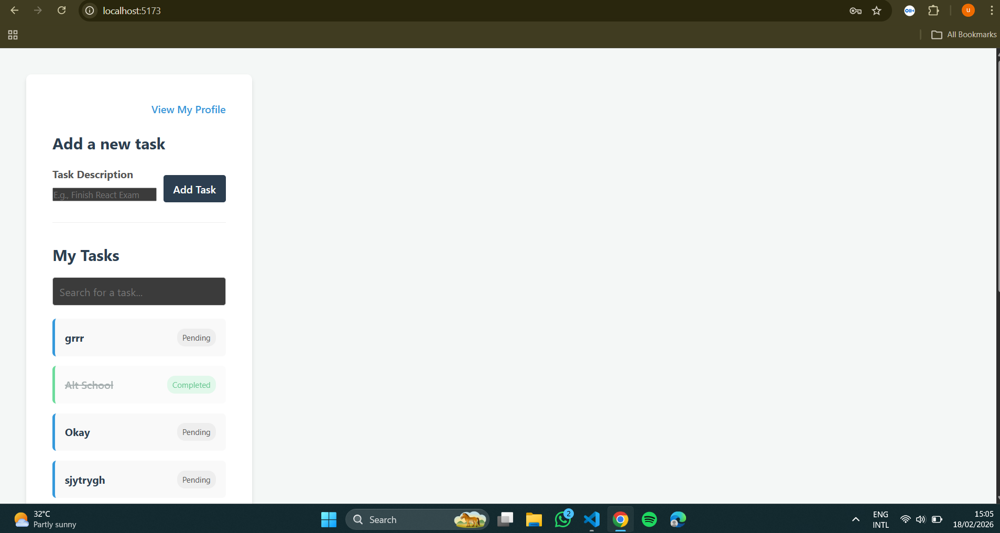
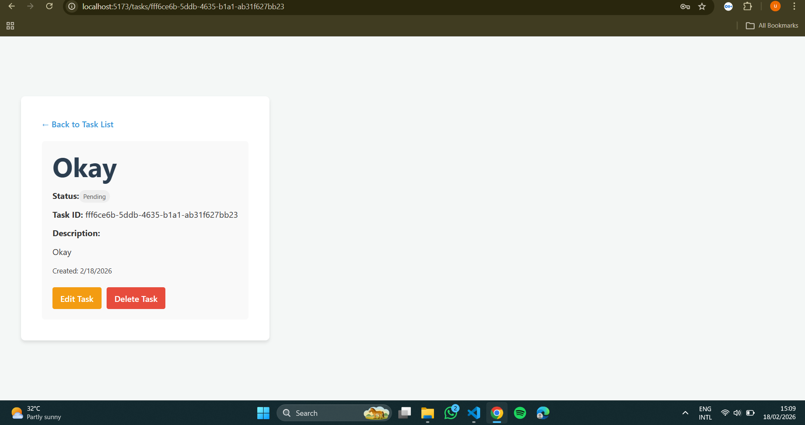

# React Task Management App

## Project description and features
This is my first major React project! It is a task management application where users can create an account, log in, and keep track of their daily tasks. I built this to practice and demonstrate what I have learned about React, routing, and working with APIs.

Here are the main features of the app:
* User Accounts: You can sign up and log in securely.
* Protected Pages: You cannot view the task dashboard unless you are logged in with a valid token.
* Full CRUD: Users can create new tasks, read their task list, update a task to show it is completed, and delete tasks they no longer need.
* Search and Pagination: I added a search bar to find specific tasks, and pagination so the page doesn't get too crowded if you have a lot of tasks.
* Lazy Loading: I used React lazy loading so the app runs faster and only loads pages when the user actually clicks on them.
* Error Boundaries: If something goes wrong, the app shows a friendly error screen instead of completely breaking.

## Setup instructions
If you want to run my code on your own computer, here is how you can set it up:
1. Clone this repository to your computer.
2. Open your terminal and navigate into the project folder.
3. Type `npm install` and press enter. This will download all the necessary packages I used.
4. Type `npm run dev` to start the local development server.
5. Open your browser and go to the link provided in the terminal (it is usually http://localhost:5173).

## Available scripts
These are the commands you can run in the terminal for this project:
* `npm run dev`: This starts the app on your computer so you can work on it and test it.
* `npm run build`: This bundles the app up and gets it ready to be deployed to the internet.
* `npm run lint`: This checks my code to help find any syntax or style mistakes.
* `npm run preview`: This lets you preview the final production build locally before you deploy it.

## Technology choices and reasoning
Here are the tools I chose to use for this project and why:
* React and Vite: I used React because it is the main framework I am learning, and Vite makes creating the project super fast compared to older tools.
* React Router DOM: I used this to handle navigation so users can go from the login page to the home page without the web browser having to reload.
* TanStack Query (React Query): I used this for fetching data from the API. It is really helpful because it handles loading states and caching automatically, which saved me from writing a lot of complicated code.
* TanStack Form: I used this to manage the sign-up and login forms and make sure users type in their information correctly.
* Plain External CSS: Instead of using a big CSS framework, I wrote plain CSS. This helped me practice my styling skills and ensure the app is mobile-responsive using a single pattern of design.

## Screenshots or GIFs of key features
[//]: # (Note: Make sure to put your actual screenshots in a folder named 'screenshots' before you push this to GitHub)

* Login Screen: 

* Task Dashboard: 

* Task Details Page: 

## Known issues and future improvements
Known Issues:
* The login token expires for security reasons. If you leave the app open for too long, you might see an "Invalid token" error and will have to log out and log back in.

Future Improvements:
* I would love to add a dark mode toggle because many users prefer dark themes.
* I want to learn how to add drag-and-drop features so users can manually rearrange the order of their tasks.